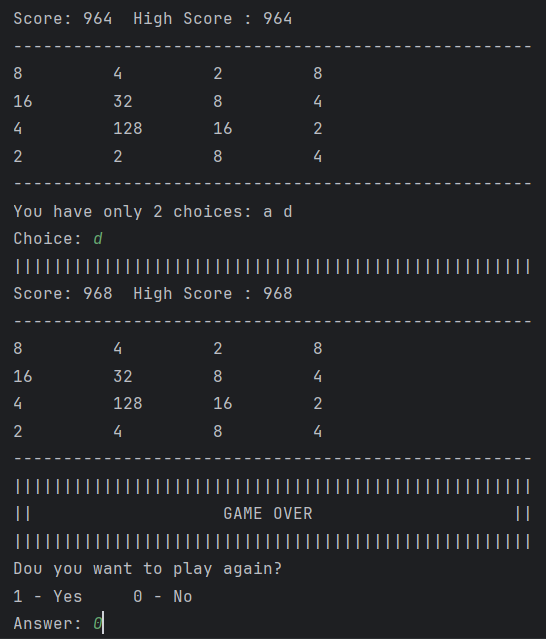

# game-2048-basic
This is a simple, text-based implementation of the popular 2048 game created in Java. It was my first game project when I was learning Java in my second month of programming. The code reflects my early understanding of Java.

## Game Overview
In the **2048** game, the goal is to combine matching tiles to create a tile with the number **2048**. The game is played on a grid, and you can move the tiles using the following controls:
- `w` = Up
- `a` = Left
- `s` = Down
- `d` = Right

The game generates random tiles (either a 2 or a 4) after each move. The game continues until there are no more valid moves left.

*Note*: The code is not optimized for performance or efficiency.

## Screenshots

Here are some screenshots of the game in action:

---

---

---

---

